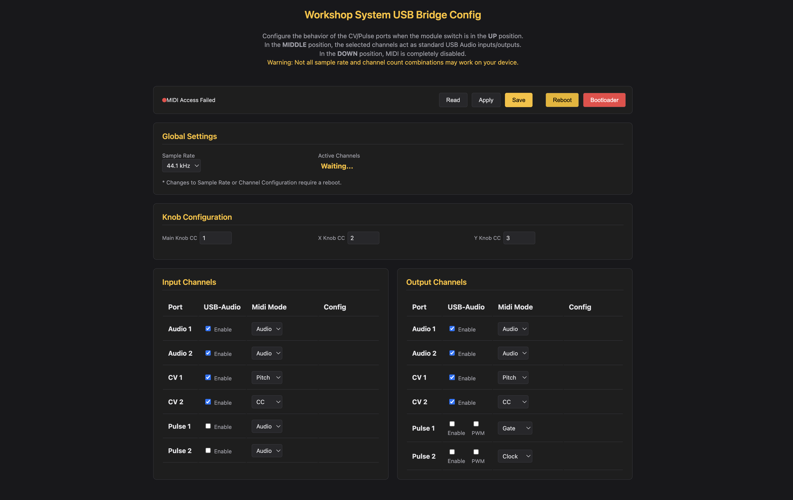

# USB Audio & MIDI Interface

Turns the Workshop Computer into a class-compliant multichannel USB audio interface and USB MIDI device with integrated CV/Gate support.

- **6-Channel USB Audio**: Route up to 6 audio channels into and out of your DAW.
- **USB MIDI to CV/Gate**: Control modular gear with MIDI notes, clock, and CCs, or send CV into your DAW as MIDI.
- **Web MIDI Editor**: Configure routing, channel counts, and sample rates directly in your browser.

---

## Operating Modes

Set **Switch Z** on the Workshop Computer panel to select the active mode:

| Switch Position | Mode Name | Description |
|:---:|---|---|
| **Middle** | **Normal Mode (6-Channel Audio)** | All 6 hardware jacks map directly to USB audio streaming channels 1–6 in your DAW. |
| **Up** | **Alt Mode (MIDI + Audio)** | Enables CV, Gate, and Clock MIDI conversion while maintaining stereo audio on USB channels 5 & 6. |
| **Down** | **Audio Only Mode** | Disables USB MIDI processing to dedicate maximum USB bandwidth strictly to audio streams. |

---

## Alt Mode (Switch Up) Jack Mapping

When **Switch Z** is set **UP**, hardware jacks provide MIDI to CV/Gate integration:

### Inputs
- **Audio In 1 & 2**: Stereo passthrough routed to USB audio channels 5 & 6.
- **CV In 1**: 1V/Oct pitch CV input (converts incoming CV to MIDI notes).
- **CV In 2**: CC modulation source (converts CV to CC values).
- **Pulse In 1**: Gate input associated with CV 1 pitch tracking.
- **Pulse In 2**: External clock or run gate input.

### Outputs
- **Audio Out 1 & 2**: Stereo audio playback from USB channels 5 & 6.
- **CV Out 1**: 1V/Oct pitch CV output (converts incoming MIDI notes to 1V/Oct).
- **CV Out 2**: CC modulation CV output.
- **Pulse Out 1**: Gate / trigger output (fires on MIDI note events).
- **Pulse Out 2**: Clock / run gate output.

---

## Controls & MIDI CC

When MIDI functionality is active (Middle or Up mode), physical knobs send MIDI CC messages:

- **Main Knob**: Transmits MIDI CC 1 (Modulation).
- **Knob X**: Transmits MIDI CC 2 (Breath / Expressive).
- **Knob Y**: Transmits MIDI CC 3 (Undefined / Custom).

---

## Web Configuration & Settings

Configure sample rates, channel masks, and custom CC/Gate routing using the [USB Audio Web Editor](https://vincentmaurer.de/usb-audio/midi_config.html). Settings save directly to the device's onboard flash memory.



### Default Factory Settings
- **Sample Rate**: 44.1 kHz
- **Active Channels**: 4 Channels (Audio 1/2 + CV 1/2) enabled for both Input and Output.
- **Input Mapping**: Audio 1/2 (Audio Stream), CV 1 (Pitch Ch 1), CV 2 (CC 4 Ch 1), Pulse 1 (Gate).
- **Output Mapping**: Audio 1/2 (Audio Stream), CV 1 (Pitch Ch 1), CV 2 (CC 4 Ch 1), Pulse 1 (Gate), Pulse 2 (Clock).

> [!NOTE]
> **OS & USB Bandwidth Guidance**
> 
> The RP2040 USB interface operates at Full Speed (USB 1.1). Bandwidth varies by host OS:
> - **macOS**: Up to 6 Channels @ 48 kHz.
> - **Windows**: Recommended **4 Channels @ 44.1 kHz** or **6 Channels @ 24 kHz** for optimal stability.
> - **Linux**: 2 Channels up to 48 kHz; 4 Channels up to 24 kHz.

---

## Firmware Flashing

1. Hold the **BOOTSEL** button on your Pico / Workshop Computer board while plugging in the USB cable.
2. Drag and drop `usb_audio_midi_interface.uf2` onto the mounted `RPI-RP2` drive.

---

## Building from Source (Developer Info)

> [!IMPORTANT]
> **TinyUSB Library Update Required**
> 
> When building from source using the Pico SDK, ensure the embedded `tinyusb` library is updated to avoid USB audio class stability bugs:
> ```bash
> cd $PICO_SDK_PATH/lib/tinyusb
> git checkout master
> git pull
> ```

### Build Steps

```bash
mkdir build
cd build
cmake ..
make
```

---

Created for the Music Thing Modular Workshop System by Vincent Maurer with assistance from Google Gemini. Special thanks to Chris Johnson for the initial USB-Audio base and the ComputerCard library.
