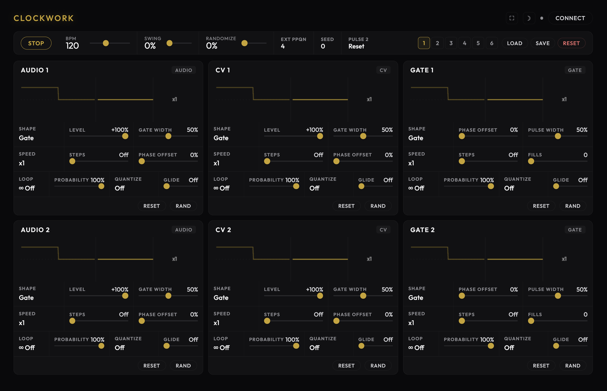

# Clockwork

A 6-channel polyrhythmic timing and modulation card for the Workshop Computer, inspired by ALM Pamela’s Workout.

Clockwork turns the Workshop Computer into a central clock generator, gate sequencer, LFO source, and USB MIDI interface. Each of its 6 independent outputs generates clock divisions and multiplications, Euclidean rhythms, custom LFO shapes, or decay envelopes.

- **6 Output Channels**: Configure each channel independently for gates, ratchets, envelopes, LFOs, random voltages, or CV delay lines.
- **Euclidean Engine**: Built-in Euclidean pattern generators (0 to 16 steps) with fills and step rotation offsets.
- **Clock Sync**: Automatically syncs to incoming USB MIDI clock or external pulse clock, or runs on its internal clock engine.
- **USB Device & Host Modes**: Connect to a computer for Web MIDI Manager telemetry and DAW clock sync, or plug a USB MIDI controller directly into the card in host mode to drive channels with MIDI note, velocity, and pitch.
- **Web MIDI Manager**: Interactive browser-based editor (`web/index.html`) with real-time oscilloscope telemetry, Euclidean orbits, and preset backup.

---

## Videos & Media

- **Tutorial Walkthrough**: [Clockwork Tutorial Video](https://www.youtube.com/watch?v=Pc0wPOAVZmw)
- **Performance Demo**: [Clockwork Demo Video](https://www.youtube.com/watch?v=WFxAQ-dK7CM)

---

## Patch Ideas

- **Synthesized Kick Drums**: Set an analog output channel to `Envelope` or `Log Env` shape with a short decay time. Patch the output directly into an oscillator's pitch or filter FM input to synthesize punchy kick drums.
- **Euclidean Snare & Percussion Patterns**: Set a digital gate output to a Euclidean rhythm (e.g., 12 or 16 steps with 5 fills) and ratchet subdivisions. Use the gate to trigger a noise generator or slope generator for shifting percussion.
- **Quantized Sample & Hold Melodic Lines**: Set an analog output channel to `S&H` shape, set its speed modifier to a cross-channel trigger (so it clocks in sync with another channel), and enable a quantizer scale (e.g. Minor Pentatonic or Harmonic Minor). Set pattern loop length to 8 or 16 steps for repeating, in-key melodic sequences and arpeggios.
- **Cross-Modulated Waveforms & Math Logic**: Set an analog channel to `Math` shape and select another channel's LFO or trigger as the modulator. Use Knob Y in Shape mode to combine the signals using Multiplication (*), Minimum (min), Maximum (max), or Logic operators (AND, OR, XOR) to generate complex, evolving modulation waves.

---

## Operating Modes & Switch Controls

Clockwork uses **Switch Z** (Up, Middle, and spring-loaded momentary Down) to navigate pages and adjust settings:

| Switch Position | Mode Name | Description |
|:---:|---|---|
| **Middle** | **Rhythm** | **Main** = Speed Modifier (`/2048` to `/2`, `x1` at noon, `x2` to `x128`, Cross-Triggers, MIDI Mode); **X** = Euclidean Steps (`0` to `16`); **Y** = Fills (when steps > 0) or LFO Phase Offset (when steps = 0). |
| **Up** | **Shape** | **Main** = Waveform Shape; **X** = Output Level / Phase Delay (bipolar `-100%` to `+100%`); **Y** = Wave Parameter (pulse width, decay, or math operator).<br>*Short flick UP (<400ms) toggles Play/Pause.* |
| **Down (Held)** | **Advanced** | **Main** = Pattern Loop Length (`1` to `64` steps, `0` = infinite); **X** = Trigger Probability (`0%` to `100%`); **Y** = Step Rotation Offset (when steps > 0) or Quantizer Scale (when steps = 0). |
| **Down (Tap)** | **Page Cycle** | Tap briefly to step forward through channels 1–6 and the Global Page (indicated by lit LEDs). Hold slightly and release to cycle backward. |

---

## Global Page Settings (All 6 LEDs Pulsing)

Cycle past Channel 6 to reach the Global Page:

- **Switch Middle**: **Main** = Master BPM; **X** = Swing; **Y** = Humanize / Randomization (subtle timing jitter at lower settings; skips beats or randomizes voltages at higher settings).
- **Switch Up**: **Main** = External Clock PPQN; **X** = Random Seed (swaps random sequence patterns); **Y** = Pulse 2 Input Mode (selects Gate or Run gate).
- **Switch Down (Held)**: **Preset Menu**: **Main** = Select preset slot (1–6) or Reset; **X** = Turn left to Load, right to Save, or Reset.

---

## Special Speed Modifier Settings (Right Side of Speed Knob)

Rotating the Main Speed knob past `x128` in Middle mode accesses special clocking modes:

- **Cross-Channel Triggers**: Clocks the active channel loop from another channel's gate transitions (e.g. Channel 2 clocks Channel 1). Ideal for synced Sample & Hold or cross-clocked LFOs.
- **MIDI Mode**: Clocks the channel from USB MIDI input (Channels 1–6). Automatically maps MIDI notes, velocity, or pitch to output shapes.

---

## Quantizer Scales (Switch DOWN Held, Steps = 0)

Turn Knob Y while holding Switch DOWN (when Euclidean steps = 0) to snap smooth random walks or LFOs to musical scales for playing melodies and arpeggios:
`OFF` (Raw CV), `CHRO` (Chromatic), `MAJ` (Major), `MPEN` (Major Pentatonic), `MIN` (Natural Minor), `MINP` (Minor Pentatonic), `DOR` (Dorian), `MIXO` (Mixolydian), `LYD` (Lydian), `PHRY` (Phrygian), `HMIN` (Harmonic Minor).

---

## Panel Jack Reference

### Inputs (Jacks 1–4 correlate to Channels 1–4)
Patching a cable into jacks 1–4 overrides default channel behavior depending on active shape:
- **Audio In 1 (Channel 1 CV Input / Audio 1)**: Modulates Channel 1 wave parameter, S&H sample input, CV delay input, Math carrier, or external clock trigger.
- **Audio In 2 (Channel 2 CV Input / Audio 2)**: Modulates Channel 2 wave parameter, S&H sample input, CV delay input, Math carrier, or external clock trigger.
- **CV In 1 (Channel 3 CV Input / CV 1)**: Modulates Channel 3 wave parameter, S&H sample input, CV delay input, Math carrier, or external clock trigger.
- **CV In 2 (Channel 4 CV Input / CV 2)**: Modulates Channel 4 wave parameter, S&H sample input, CV delay input, Math carrier, or external clock trigger.
- **Pulse In 1 (External Clock Sync / Pulse 1)**: External clock pulse sync input.
- **Pulse In 2 (Reset / Run Gate / Pulse 2)**: Clock reset trigger input or run gate.

### Outputs
- **Audio Out 1 (Output 1)**: Channel 1 bipolar/unipolar CV, LFO, envelope, or gate output (SPI DAC).
- **Audio Out 2 (Output 2)**: Channel 2 bipolar/unipolar CV, LFO, envelope, or gate output (SPI DAC).
- **CV Out 1 (Output 3)**: Channel 3 bipolar/unipolar CV, LFO, envelope, or gate output (PWM).
- **CV Out 2 (Output 4)**: Channel 4 bipolar/unipolar CV, LFO, envelope, or gate output (PWM).
- **Pulse Out 1 (Output 5)**: Channel 5 digital gate output (Gate, Ratchet, Trigger, Burst, Random, Utility).
- **Pulse Out 2 (Output 6)**: Channel 6 digital gate output (Gate, Ratchet, Trigger, Burst, Random, Utility).

---

## Output Waveforms & Parameter Reference

Active shapes are displayed on the 6 panel LEDs as a 3x2 matrix (`●` = ON, `○` = OFF):
```
Row 1: [LED 0] [LED 1]
Row 2: [LED 2] [LED 3]
Row 3: [LED 4] [LED 5]
```

### 1. Analog Outputs (Channels 1–4 / Jacks 1–4)
Bipolar (`-6V` to `+6V`) or unipolar (`0V` to `+6V`).

| Index | Shape Name | LED Matrix (3x2) | Knob Y Parameter |
|:---:|---|:---:|---|
| **0** | Gate | ○○ / ○○ / ○○ | Duty cycle / pulse width |
| **1** | Ratchet | ●○ / ○○ / ○○ | Subdivisions (2, 3, 4, 6, 8, 12, or 16 pulses) |
| **2** | Sine | ○● / ○○ / ○○ | Phase offset (0° to 360°) |
| **3** | Triangle | ●● / ○○ / ○○ | Skew (falling saw ↔ tri ↔ rising saw) |
| **4** | Saw ↑ | ○○ / ●○ / ○○ | Curve skew (log ↔ linear ↔ exp) |
| **5** | Saw ↓ | ●○ / ●○ / ○○ | Curve skew (log ↔ linear ↔ exp) |
| **6** | Trapezoid | ○● / ●○ / ○○ | Peak flat sustain duration |
| **7** | Hump | ●● / ●○ / ○○ | Peak center skew |
| **8** | Envelope | ○○ / ○● / ○○ | Linear decay duration |
| **9** | Log Env | ●○ / ○● / ○○ | Exponential decay duration |
| **10** | S&H | ○● / ○● / ○○ | Random Sample & Hold (1V/Oct pitch in MIDI mode) |
| **11** | Smooth | ●● / ○● / ○○ | Smoothing/slew rate (MIDI velocity in MIDI mode) |
| **12** | Delay | ○○ / ●● / ○○ | CV delay feedback level |
| **13** | Math | ●○ / ●● / ○○ | Math logic operator (Mix, Sub, Min, Max, Mult, AND, OR, XOR) |

### 2. Digital Gate Outputs (Channels 5–6 / Jacks 5–6)
Unipolar (`0V` to `+6V`).

| Index | Shape Name | LED Matrix (3x2) | Knob Y Parameter |
|:---:|---|:---:|---|
| **0** | Gate | ○○ / ○○ / ○○ | Pulse width / duty cycle |
| **1** | Ratchet | ●○ / ○○ / ○○ | Double trigger spacing |
| **2** | Trigger | ○● / ○○ / ○○ | Phase delay (10ms fixed pulse width) |
| **3** | Burst | ●● / ○○ / ○○ | Pulse count (1 to 8 triggers) |
| **4** | Random | ○○ / ●○ / ○○ | Max random gate width scale |
| **5** | Utility | ●○ / ●○ / ○○ | Utility mode (1 PPQN, 4 PPQN, 24 PPQN, Run Gate) |

---

## Web MIDI Manager

Open `web/index.html` in Chrome or Edge, or visit the online [Clockwork Web Manager](https://vincentmaurer.de/clockwork/index.html).



- **Live Oscilloscope**: Monitor output voltages across all 6 channels in real time.
- **Euclidean Orbits**: Concentric rings showing step counts, active fills, phase offsets, and rotations.
- **Instant Hardware Sync**: Turning hardware knobs updates the web browser live, and tweaking web UI controls updates the card immediately.
- **Preset Manager**: Save, load, name, and back up 6 preset slots to disk or internal flash memory.
- **Routing & Scale Controls**: Configure cross-channel triggers, math operators, and quantizer scales visually.

---

## Building from Source (Developer Info)

```bash
mkdir build
cd build
cmake ..
make
```

Flash the generated `clockwork.uf2` by holding **BOOTSEL** while connecting the card via USB-C.

---

Created for the Music Thing Modular Workshop System by Vincent Maurer with assistance from Google Gemini. Special thanks to Tom Whitwell and Chris Johnson.
