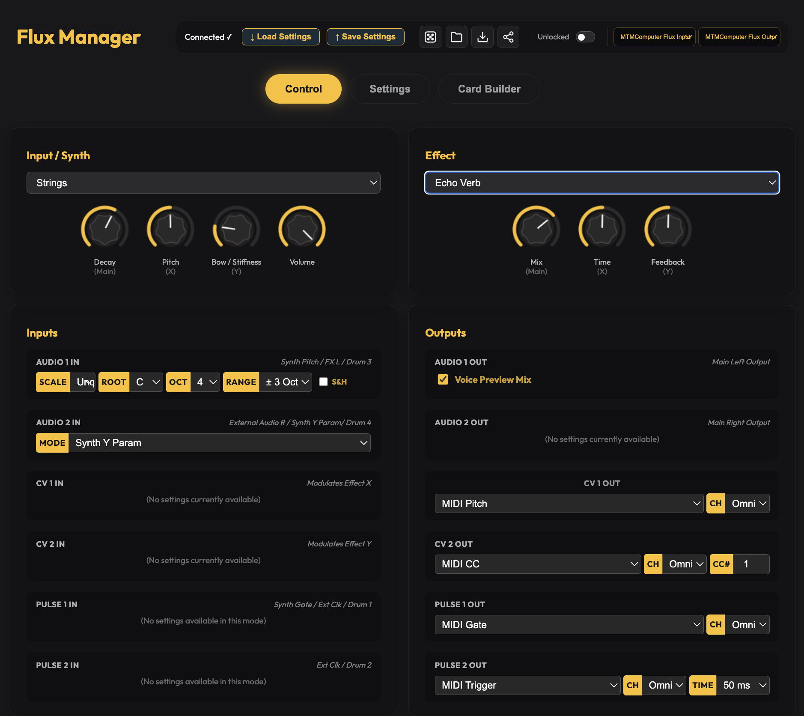

# Flux

A multi-effects processor, 4-voice polyphonic synthesizer, and CV utility card for the **Workshop Computer**.

Flux leverages dual RP2040 core processing: **Core 0** runs a rich stereo multi-effects processor, while **Core 1** runs 14 synthesizer and sampler engines alongside 4 configurable CV/pulse utility output generators.

- **Dual-Core Architecture**: Core 0 processes stereo FX (reverbs, delays, guitar amps, lossy MP3 degradation, pitch shifting, micro-looping); Core 1 runs synthesizers, samplers, and output utilities.
- **14 Synth & Sampler Engines**: Wavetable, Virtual Analog, String physical modeling, AMY Piano, 6-op FM, Modal, One-Shot/Loop Samplers, Drum Kits, and Granular.
- **4 Utility Output Generators**: Assign CV 1/2 and Pulse 1/2 to MIDI-to-CV, ADSR envelopes, multi-shape LFOs, step sequencers, generative sequencers, or a port of Mutable Instruments Grids.
- **4-Voice Polyphony & USB MIDI**: Play synthesizers polyphonically using USB MIDI keyboards or external CV/gate inputs.
- **Flux Web Manager**: Interactive browser app (`web/flux_manager.html`) for drag-and-drop sample management, patch card sharing, and utility output configuration.

---

## Videos & Media

- **Demo Video**: [Flux Demo Video](https://youtu.be/oDZ6dwLnN7c)
- **Tutorial Walkthrough**: [Flux Tutorial Video](https://www.youtube.com/watch?v=O13SB2aEhhc)

---

## Operating Modes & Switch Controls

Flux uses **Switch Z** (Up, Middle, and spring-loaded momentary Down) to select control layers:

| Switch Position | Mode Name | Description |
|:---:|---|---|
| **Middle** | **Effect Mode** | **Main** = Wet/Dry Mix; **X** = Effect Param 1 (Time/Decay/Rate); **Y** = Effect Param 2 (Feedback/Tone/Depth). |
| **Up** | **Synth Mode** | **Main** = Envelope Decay; **X** = Oscillator Pitch; **Y** = Timbre / Filter Cutoff / Color. |
| **Down (Hold)** | **Select Menu** | **Main** = Select Effect Algorithm; **X** = Select Synth Engine; **Y** = Extra Parameter / Cutoff. |
| **Down (Double-Hold)** | **Performance** | **Main** = Master BPM Tempo; **X** = Sequence A Length/Randomness; **Y** = Sequence B Length/Randomness. |

---

## Synthesizer Engines (14 Engines)

Toggle Switch DOWN and turn Knob X to select a synth engine:

1. **External Input**: Audio passthrough from inputs into the multi-FX engine.
2. **Wavetable**: Morphing wavetable oscillator (Triangle ➔ Saw ➔ Square ➔ Pulse).
3. **Virtual Analog**: Dual oscillator stack into a resonant filter (**Y** = Filter Cutoff).
4. **Strings**: Karplus-Strong physical string model (**Y** = Stiffness and bowing).
5. **Piano**: Additive spectral piano engine powered by AMY (**Y** = Brightness).
6. **Modal**: Physical modeling of metallic bells, wood blocks, and percussion (**Y** = Inharmonic structure).
7. **FM Synth**: 6-operator DX7 style FM engine (**Main** = Env Speed, **Y** = Mod Depth).
8. **Noise**: White noise generator through a low-pass gate (**Y** = Filter).
9. **One-Shot Sampler**: Triggered sample playback from flash memory (**X** = Pitch, **Y** = Sample Select).
10. **Looping Sampler**: Looping sample playback (**X** = Pitch, **Y** = Sample Select).
11. **Sample Player**: Continuous sample player (**Main** = Length/Direction, **X** = Pitch, **Y** = Start Position).
12. **Drum Sampler**: 4-voice sample drum kit triggered via Pulse 1/2 or Audio L/R (**Y** = Kit Select).
13. **Granular Sampler**: Shared grain pool generator (**Main** = Density, **X** = Pitch, **Y** = Grain Position).
14. **Drum Synth**: Synthesized drum engine (**Main** = Kick decay, **X** = Snare, **Y** = Hi-Hat).

---

## Multi-Effects Algorithms

Toggle Switch DOWN and turn the Main knob to select an effect algorithm:

### Dynamics & Amps
0. **No Effect (Bypass)**: Passthrough dry audio (**X** = Synth/input volume).
1. **Compressor**: Dynamic range audio compressor.
2. **Equalizer**: Tone EQ frequency balance.
3. **Guitar Amp**: Guitar amplifier overdrive and cabinet simulation.

### Modulation & Pitch
4. **Tremolo**: Amplitude volume modulation.
5. **Sine Chorus**: Smooth sine LFO stereo chorus.
6. **Vibrato Chorus**: Pitch vibrato and chorus modulation.
7. **Bitcrusher**: Bit-depth and sample-rate reduction.
8. **Pitch Shift**: Bipolar pitch shifting.
9. **Frequency Shift Delay**: Frequency shifter with feedback delay.

### Delays
10. **Digital Delay**: Clean digital delay line.
11. **Tape Delay**: Warm tape delay with saturation and flutter.
12. **Ping Pong Delay**: Alternating stereo ping-pong delay.
13. **Tape Loop**: Sound-on-sound infinite tape looper.
14. **Echoverb**: Hybrid delay line feeding a reverb tail.

### Reverbs
15. **Plate Reverb**: Dense metallic plate reverberation.
16. **Spring Reverb**: Mechanical spring tank reverb with drip.
17. **Freeverb**: Classic Schroeder-Moorer algorithmic reverb.
18. **Shimmer Reverb**: Octave pitch-shifted reverb tail.
19. **Cathedral Reverb**: Large hall and cathedral reverb space.
20. **Granular Clouds**: Granular texture cloud reverb.
21. **Basic Reverb**: Efficient low-resource reverb.
22. **Allpass Reverb**: Allpass filter matrix reverb.
23. **Hadamard Reverb**: Hadamard matrix spatial reverb.

### Experimental
24. **Micro Looper**: Audio slice slicer and reverser.
25. **Tape Degradation**: Wow, flutter, and tape wear simulator.
26. **Lossy Audio**: MP3 compression artifacts and packet loss simulator.
27. **Spectral Freeze**: Freezes the frequency spectrum of incoming audio.
28. **Oil-Can Echo**: Dark oil-can delay unit emulation.
29. **Resonator**: Tuned resonant bandpass filter bank.
30. **Wind**: Atmospheric wind generator.
31. **Chatter**: Formant chatter and vocal resonance.

---

## Utility Output Generators

Flux provides 4 assignable hardware outputs configured via the Web UI or double-tap menu:

### CV Outputs 1 & 2
- **MIDI Pitch / Velocity / CC**: Converts USB MIDI input to calibrated 1V/Oct CV and velocity.
- **Synth ADSR**: Internal envelope generators from synth voices.
- **LFO Utility**: Multi-shape LFO (Sine, Triangle, Saw, Square, Smooth Random).
- **Step Sequencer A & B**: Dual 16-step CV sequencers with scale quantization.
- **Generative Sequencer A & B**: Algorithmic random walk CV generators.
- **Clock**: Clock division CV ramps.

### Pulse Outputs 1 & 2
- **MIDI Gate / Trigger**: Note gates and trigger pulses from USB MIDI input.
- **Clock Out**: Master clock pulses with divisions.
- **Seq A & B Gate**: Gate pulses from step sequencers.
- **Mutable Instruments Grids**: Drum pattern generator port for driving external drum modules.

---

## Patch Ideas

- **4-Voice Polyphonic FM Synth**: Connect a USB MIDI keyboard to the card's USB-C port, select the FM Synth engine, set Switch Z to UP, and select Cathedral or Shimmer Reverb in Effect mode for polyphonic synth pads.
- **Lossy Audio Drum Degrader**: Route external drum loops into Audio In 1, select the `Lossy Audio` effect in Effect Mode, and adjust Knob X to add MP3 compression artifacts and packet loss textures.
- **Granular Pitch-Shift Cloud**: Route audio into Audio In 1, select `Granular Clouds` or `Micro Looper`, and modulate CV In 1 with an external LFO for evolving granular micro-slice clouds.
- **Self-Patched Generative Drum Machine**: Set Pulse Out 1 and 2 to `Grids` (drum map generator), patch Pulse Out 1 into Pulse In 1 (Kick) and Pulse Out 2 into Pulse In 2 (Snare), select the `Drum Sampler` engine, and adjust Knob X to change drum pattern density.

---

## Flux Web Manager

Open `web/flux_manager.html` in Chrome or Edge, or visit the online [Flux Web Manager](https://vincentmaurer.de/flux/flux_manager.html).



- **Engine & Effect Selection**: Visual dashboard for switching synth engines, effects algorithms, and voice announcements.
- **Drag-and-Drop Sample Builder**: Upload custom WAV files, edit start/end loop points, and compile custom sample banks.
- **Utility Output Routing**: Visual matrix for configuring CV/Pulse output utilities (MIDI-to-CV, LFOs, Step Sequencers, MI Grids).
- **Patch Cards Export & Import**: Share, backup, and load digital patch card files directly to your card.

---

## Building from Source (Developer Info)

```bash
mkdir build
cd build
cmake ..
make
```

Flash the generated `flux.uf2` by holding **BOOTSEL** while connecting the card via USB-C.

---

Created for the Music Thing Modular Workshop System by Vincent Maurer with assistance from Google Gemini. Special thanks to Tom Whitwell and Chris Johnson.
