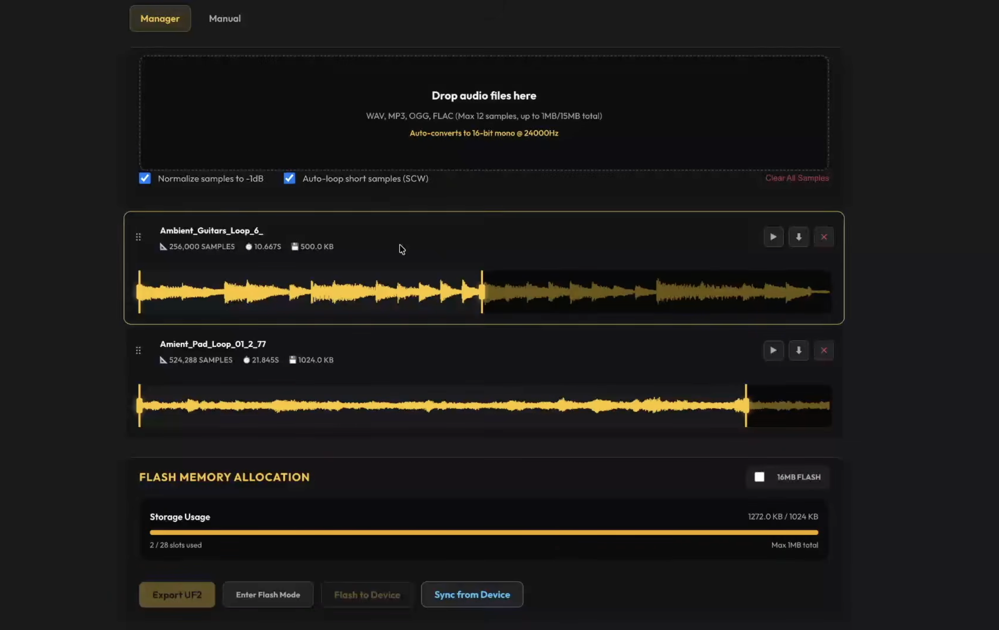

# Grains

A granular sampler, live audio cloud processor, and scrubbable tape player for the **Workshop Computer**.

Grains captures live audio input or streams stored audio from 16 internal flash memory slots, slicing the audio into micro-grains. It provides real-time control over grain density, grain size, read position, pitch, continuous window envelopes, feedback diffusion, stereo spread, and onboard reverb.

- **4 Control Pages**: Page 1 (Grain Control), Page 2 (Tone & Pitch), Page 3 (Mix & Spread), Page 4 (Reverb).
- **Freeze Mode**: Lock the active audio buffer live and save persistent recordings into memory slots.
- **16 Sample Slots**: Slots 1–4 store persistent live-recorded buffers; Slots 5–16 store custom user audio files streamed directly from flash with zero latency.
- **Tape Mode**: Special power-up mode transforming the card into a scrubbable tape player with manual position scrubbing and playhead CV.
- **Grains Sample Manager**: Web browser app (`web/grains_sample_manager.html`) for editing sample start/end points, normalizing audio, auto-looping single cycles, and flashing samples directly to the RP2040 card.

---

## Videos & Media

- **Tutorial Walkthrough**: [Grains Tutorial Video](https://www.youtube.com/watch?v=eWROkerT890)

---

## Operating Modes & Switch Controls

Grains uses **Switch Z** (Up, Middle, and spring-loaded momentary Down) to navigate pages and manage memory:

| Switch Position | Mode Name | Description |
|:---:|---|---|
| **Middle** | **Live Mode** | Normal granular operation. Navigate through the 4 control pages using tap DOWN. |
| **Up** | **Toggle Freeze** | Flick UP to freeze the current live audio buffer (LED 5 lights). Flick UP again to unfreeze. |
| **Down (Tap)** | **Page Cycle** | Tap briefly to step forward through Page 1 (Grain Control), Page 2 (Tone/Pitch), Page 3 (Mix/Spread), and Page 4 (Reverb). |
| **Down (Hold 2s)** | **Slot Menu** | **Unfrozen**: Opens Load Menu (LED 5 lights). **Frozen**: Opens Save Menu (LED 4 lights). Turn Main knob to select slot 1–16 (displayed in 4-bit binary on LEDs 1–4). Release switch to execute. |
| **Down (Power-Up)** | **Tape Mode** | Hold Switch DOWN during power-up LED chase sequence to enter Tape Mode (LED 4 remains lit). |

---

## Control Pages

### Page 1: Grain Control
- **Main Knob**: Position (Grain read position in captured buffer/sample).
- **X Knob**: Density (Anti-clockwise = random grain spawning; Clockwise = periodic grain spawning).
- **Y Knob**: Size (Grain window duration, from short clicks to long overlapping clouds).

### Page 2: Grain Tone & Pitch
- **Main Knob**: Pitch (Grain pitch transposition and detuning).
- **X Knob**: Jitter / Chords / Reverse Chance (Left = timing jitter; Center = pitch chords; Right = reverse playback chance).
- **Y Knob**: Window Envelope Shape (Continuous blend across Hann, Decay, Square, Gauss, and Inverted Decay).

### Page 3: Mix & Spread
- **Main Knob**: Wet / Dry Mix (Blend between live input signal and granular engine output).
- **X Knob**: Feedback / Diffusion (Feedback level in live mode; grain diffusion in freeze mode).
- **Y Knob**: Stereo Spread (Stereo field width and random grain spatial panning).

### Page 4: Reverb
- **Main Knob**: Reverb Mix (Wet level for the built-in reverb effect).
- **X Knob**: Room Size (Reverb decay time and space size).
- **Y Knob**: Damping (High-frequency damping filter for the reverb tail).

---

## Panel Jack Reference

### Inputs
- **Audio In 1 (Audio Input 1 / Left)**: Source audio for granular recording, live processing, and delay feedback.
- **Audio In 2 (Audio Input 2 / Right)**: Right channel audio input or CV modulation for grain density.
- **CV In 1 (Pitch CV)**: 1V/Octave calibrated tracking for grain pitch or tape playback pitch.
- **CV In 2 (Position CV)**: Granular playhead position offset or tape scrub position modulation.
- **Pulse In 1 (Grain Trigger / Play Gate)**: External pulse trigger to spawn grains, or play/pause gate in tape mode.
- **Pulse In 2 (Freeze / Reset)**: Toggles live buffer freeze in granular mode; resets playhead to start in tape mode.

### Outputs
- **Audio Out 1 (Output 1 / Left)**: Main processed left audio output (Wet/Dry blend).
- **Audio Out 2 (Output 2 / Right)**: Main processed right audio output (Stereo Spread).
- **CV Out 1 (Playhead Ramp CV)**: Looping 0–5V ramp CV output synced to buffer length or tape playhead progress.
- **CV Out 2 (Grain Motion / Speed CV)**: Random 0–5V CV per grain in granular mode; bipolar movement speed CV in tape mode.
- **Pulse Out 1 (Grain Spawn / EOC Trigger)**: Gate output fired on grain spawning, or End-of-Cycle pulse in tape mode.
- **Pulse Out 2 (Freeze State / Midpoint Trigger)**: HIGH when live buffer is frozen in granular mode, or midpoint pulse in tape mode.

---

## Tape Mode

Hold Switch DOWN during power-up to activate Tape Mode (indicated by lit LED 4). Tape Mode turns Grains into a manual scrubbable tape player.

- **Main Knob**: Manual playhead position scrubbing and offset.
- **X Knob**: Playback speed (noon = 1.0x normal speed).
- **Y Knob**: Loop segment length.
- **Switch UP**: Momentary pause.
- **Switch DOWN (Hold 2s)**: Open Slot Selection Menu (slots 1–16).
- **Pulse In 1**: Play / Pause Gate (HIGH = Play, LOW = Pause).
- **Pulse In 2**: Playhead reset trigger.
- **Pulse Out 1**: End-of-Cycle (EOC) trigger output.
- **Pulse Out 2**: Midpoint trigger output.

---

## Patch Ideas

- **Granular Pitch-Shift Delay**: Set Wet/Dry mix on Page 3 to 50%, increase Feedback (X knob), and adjust Pitch on Page 2 to create pitch-shifting delay tails that cascade upwards or downwards.
- **Scattered Clouds & Ambient Swells**: Set Density (X knob on Page 1) to random spawning, turn up Stereo Spread and Diffusion on Page 3, add Reverb on Page 4, and increase Grain Size for evolving atmospheric clouds.
- **Scrubbable Tape Loops**: Enter Tape Mode at bootup, load a sample slot, and patch a LFO or envelope into CV In 2 (Position) to scrub back and forth through sample slices.
- **Frozen Texture Drones**: Feed live audio into Audio In 1, flick Switch UP to freeze the buffer, turn up Diffusion on Page 3, and hold Switch DOWN to store the frozen texture into persistent memory slots 1–4.

---

## Grains Sample Manager

Open `web/grains_sample_manager.html` in Chrome or Edge, or visit the online [Grains Sample Manager](https://vincentmaurer.de/grains/grains_manager.html).



- **Sample Slot Organization**: Visual management of all 16 internal sample slots (Slots 1–4 persistent live recordings; Slots 5–16 custom user samples).
- **Audio Trimming & Normalization**: Set custom start/end points, normalize quiet samples, and enable auto-looping for single-cycle waveforms.
- **Direct Flash Synchronization**: Connect to the card via Web USB/MIDI to erase, upload, and synchronize samples and firmware directly to the RP2040 flash memory.
- **Storage Bar Indicator**: Live byte counter displaying remaining flash memory space on your card.

---

## Building from Source (Developer Info)

```bash
mkdir build
cd build
cmake ..
make
```

Flash the generated `grains.uf2` by holding **BOOTSEL** while connecting the card via USB-C.

---

Created for the Music Thing Modular Workshop System by Vincent Maurer with assistance from Google Gemini. Special thanks to Tom Whitwell and Chris Johnson.
